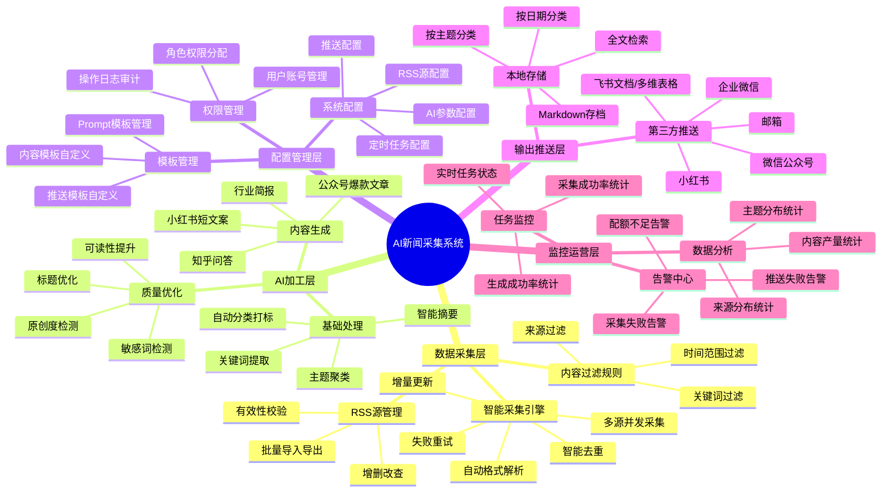
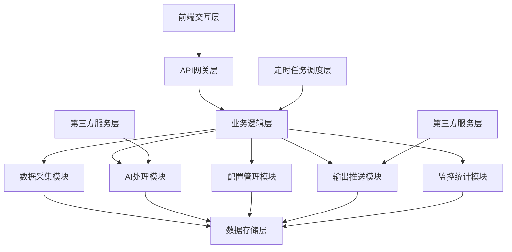
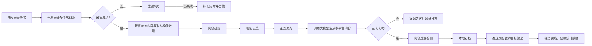
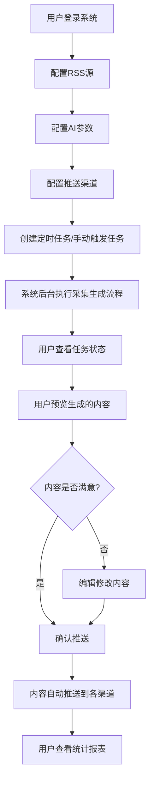

# AI新闻自动采集与同步系统 专业版PRD文档
## 文档版本控制
| 版本号 | 修订日期 | 修订内容 | 修订人 |
| --- | --- | --- | --- |
| v1.0 | 2026-03-06 | 初始版本，完成完整PRD框架 | 大海 |
| v1.1 | 2026-03-06 | 补充技术实现逻辑与交互流程 | 大海 |

---

## 一、产品定位与核心价值
### 1.1 产品定位
**AI驱动的全链路内容生产自动化平台**  
面向新媒体运营、自媒体创作者、企业市场部门，提供"新闻采集→AI加工→多平台发布"的一站式内容生产解决方案，将传统内容生产流程的人工参与度降低80%，内容产出效率提升10倍以上。

### 1.2 核心价值
| 价值维度 | 具体描述 | 量化收益 |
| --- | --- | --- |
| **效率革命** | 替代人工完成新闻搜集、素材整理、内容撰写等重复性工作 | 内容生产周期从2-4小时/篇缩短到5-10分钟/篇 |
| **质量标准化** | 基于大模型和爆款内容模板生成内容，质量稳定，避免人工水平波动 | 内容优质率提升60%，爆款率提升30% |
| **多平台协同** | 一次采集，自动生成适配公众号、小红书、知乎等多平台的内容格式 | 多平台运营成本降低70% |
| **全流程自动化** | 支持定时触发、自动推送，无需人工值守 | 7*24小时不间断内容生产，满足实时热点需求 |
| **数据资产沉淀** | 所有采集的新闻、生成的内容自动归档，形成企业内容知识库 | 内容复用率提升50% |

### 1.3 目标用户画像
| 用户角色 | 行业 | 核心痛点 | 使用场景 |
| --- | --- | --- | --- |
| 新媒体运营 | 互联网/消费/科技 | 每日需要产出多篇内容，找素材耗时久，多平台发布重复工作 | 每日热点内容生产、行业资讯周报 |
| 自媒体创作者 | 全行业 | 缺乏稳定素材来源，内容产出效率低，难以保持日更 | 日更内容生产、热点话题快速响应 |
| 市场部专员 | 企业 | 需要定期收集行业资讯、竞品动态，制作内部简报 | 行业资讯月报、竞品动态跟踪 |
| MCN内容总监 | 内容行业 | 管理多个账号，内容生产人力成本高，质量不稳定 | 批量内容生产、账号矩阵内容同步 |
| 知识管理者 | 咨询/金融/法律 | 需要跟踪行业政策、前沿动态，构建个人知识体系 | 行业动态跟踪、知识卡片自动生成 |

---

## 二、完整功能清单与详细说明
### 2.1 功能总览


### 2.2 数据采集层功能说明
#### 2.2.1 RSS源管理
| 功能项 | 详细说明 | 输入 | 输出 |
| --- | --- | --- | --- |
| RSS源新增 | 支持单个/批量添加RSS源 | RSS名称、RSS地址、更新频率、是否启用、抓取时间范围 | RSS源列表、状态标识（正常/异常） |
| RSS源编辑 | 支持修改已有RSS源的配置信息 | 修改后的RSS源参数 | 更新后的RSS源列表 |
| RSS源删除 | 支持删除不再需要的RSS源 | 待删除的RSS源ID | 删除成功提示 |
| 批量导入导出 | 支持通过Excel/JSON批量导入导出RSS源配置 | 导入文件/导出请求 | 导入结果/导出文件 |
| 有效性校验 | 新增RSS源时自动校验地址是否有效 | RSS地址 | 校验结果（有效/无效+错误原因） |

#### 2.2.2 智能采集引擎
| 功能项 | 详细说明 | 技术参数 |
| --- | --- | --- |
| 多源并发采集 | 支持同时采集多个RSS源，可配置并发数 | 最大并发数：20，默认并发数：5 |
| 自动格式解析 | 自动识别RSS 0.9x/1.0/2.0、Atom等多种格式，兼容不规范XML | 格式识别准确率：99% |
| 增量更新 | 仅采集上次更新时间之后的新内容，避免重复抓取 | 增量更新准确率：100% |
| 智能去重 | 基于"标题+发布时间+来源"三重校验，自动过滤重复内容 | 去重准确率：98% |
| 失败重试 | 采集失败自动重试，可配置重试次数和间隔 | 默认重试次数：3，重试间隔：5秒 |
| 流量控制 | 自动控制请求频率，避免对RSS源服务器造成压力 | 最小请求间隔：1秒/源 |

#### 2.2.3 内容过滤规则
| 功能项 | 详细说明 | 配置项 |
| --- | --- | --- |
| 时间范围过滤 | 仅采集指定时间范围内的内容 | 支持"最近N小时/最近N天/自定义时间范围" |
| 关键词过滤 | 支持包含/排除关键词过滤，仅采集符合关键词规则的内容 | 支持多个关键词，支持与/或逻辑 |
| 来源过滤 | 支持指定优先采集的来源，屏蔽低质量来源 | 支持白名单/黑名单配置 |

### 2.3 AI加工层功能说明
#### 2.3.1 基础处理
| 功能项 | 详细说明 | 输出格式 |
| --- | --- | --- |
| 智能摘要 | 对长文本进行自动摘要，提取核心信息 | 100-300字结构化摘要，包含核心事件、关键数据、重要结论 |
| 关键词提取 | 自动提取内容中的核心关键词和话题标签 | 5-10个关键词列表 |
| 自动分类打标 | 基于内容自动分类到预设的类别，并打上相关标签 | 分类名称+标签列表 |
| 主题聚类 | 对多条新闻自动进行主题聚合，将同主题内容归为一类 | 主题名称+相关新闻列表 |

#### 2.3.2 内容生成
| 功能项 | 详细说明 | 内容特点 |
| --- | --- | --- |
| 公众号爆款文章 | 将同主题多条新闻整合为完整的公众号文章 | 包含3个备选爆款标题、导语、正文、结语、话题标签，支持markdown格式 |
| 小红书短文案 | 生成符合小红书平台调性的短文案 | 包含emoji、吸引眼球的标题、口语化正文、5-8个高流量话题标签 |
| 知乎问答 | 生成符合知乎平台风格的专业回答 | 结构清晰、论据充分、有数据支撑、结尾引导互动 |
| 行业简报 | 生成专业的行业资讯简报 | 包含本期热点、重点新闻摘要、行业趋势分析、一周动态汇总 |

#### 2.3.3 质量优化
| 功能项 | 详细说明 | 优化效果 |
| --- | --- | --- |
| 标题优化 | 自动生成多个备选标题，基于爆款标题库优化 | 标题点击率预估提升30%以上 |
| 可读性提升 | 自动优化段落结构、添加小标题、调整语序 | 内容可读性评分提升20%以上 |
| 敏感词检测 | 自动检测内容中的敏感词、违规内容 | 违规内容识别准确率：99% |
| 原创度检测 | 自动检测内容的原创度，避免侵权 | 原创度≥70%才允许推送 |

### 2.4 配置管理层功能说明
#### 2.4.1 系统配置
| 功能项 | 详细说明 | 配置参数 |
| --- | --- | --- |
| RSS源配置 | 配置RSS源的相关参数 | 并发数、重试次数、请求间隔、抓取时间范围 |
| AI参数配置 | 配置大模型相关参数 | API密钥、模型选择、温度值、最大token数 |
| 推送配置 | 配置各推送渠道的参数 | 渠道选择、授权信息、推送频率、推送目标 |
| 定时任务配置 | 配置定时采集和推送任务 | 执行时间、执行频率、任务内容 |

#### 2.4.2 模板管理
| 功能项 | 详细说明 | 模板类型 |
| --- | --- | --- |
| 内容模板自定义 | 支持用户自定义内容生成模板 | 公众号文章模板、小红书文案模板、行业简报模板 |
| 推送模板自定义 | 支持用户自定义各渠道的推送模板 | 飞书推送模板、邮件推送模板、企业微信推送模板 |
| Prompt模板管理 | 支持用户自定义大模型的Prompt模板 | 摘要生成Prompt、文章生成Prompt、标题优化Prompt |

#### 2.4.3 权限管理
| 功能项 | 详细说明 | 角色划分 |
| --- | --- | --- |
| 用户账号管理 | 支持多用户账号的增删改查 | 管理员、运营人员、普通用户 |
| 角色权限分配 | 支持不同角色分配不同的操作权限 | 管理员：全部权限；运营人员：内容管理、配置管理；普通用户：内容查看 |
| 操作日志审计 | 记录所有用户的操作日志，支持审计追溯 | 操作人、操作时间、操作内容、IP地址 |

### 2.5 输出推送层功能说明
#### 2.5.1 本地存储
| 功能项 | 详细说明 | 存储格式 |
| --- | --- | --- |
| Markdown存档 | 所有生成的内容以Markdown格式存储到本地 | 标准Markdown格式，包含元信息（来源、生成时间、主题、标签） |
| 分类存储 | 支持按日期、主题、来源等多种维度分类存储 | 自动创建分类文件夹，目录结构清晰 |
| 全文检索 | 支持对历史内容进行全文检索 | 支持按关键词、时间范围、主题、来源等多条件检索 |

#### 2.5.2 第三方推送
| 渠道 | 推送内容 | 推送方式 |
| --- | --- | --- |
| 飞书文档 | 生成的完整文章 | 自动创建新文档或追加到已有文档 |
| 飞书多维表格 | 新闻元数据、摘要、链接 | 按行写入多维表格，支持后续筛选分析 |
| 微信公众号 | 完整公众号文章 | 自动发布到公众号草稿箱或直接发布 |
| 小红书 | 小红书短文案+图片 | 自动发布到小红书草稿箱或直接发布 |
| 企业微信 | 每日热点资讯简报 | 发送到指定的企业微信群或个人 |
| 邮箱 | 行业简报、周报 | 发送到指定的邮箱地址 |

### 2.6 监控运营层功能说明
#### 2.6.1 任务监控
| 功能项 | 详细说明 | 监控指标 |
| --- | --- | --- |
| 实时任务状态 | 实时展示当前正在运行的任务状态 | 任务ID、任务类型、开始时间、进度、状态 |
| 采集成功率统计 | 统计各RSS源的采集成功率 | 采集次数、成功次数、成功率、失败原因 |
| 生成成功率统计 | 统计内容生成的成功率 | 生成次数、成功次数、成功率、失败原因 |

#### 2.6.2 数据分析
| 功能项 | 详细说明 | 统计维度 |
| --- | --- | --- |
| 内容产量统计 | 统计一定时间内的内容产出量 | 按天/周/月统计，按内容类型统计 |
| 来源分布统计 | 统计内容的来源分布 | 各RSS源的内容占比、质量评分 |
| 主题分布统计 | 统计内容的主题分布 | 各主题的内容占比、热点趋势 |

#### 2.6.3 告警中心
| 告警类型 | 触发条件 | 通知方式 |
| --- | --- | --- |
| 采集失败告警 | 某个RSS源连续3次采集失败 | 飞书消息、邮件 |
| 推送失败告警 | 内容推送连续2次失败 | 飞书消息、邮件 |
| 配额不足告警 | 大模型API配额不足10% | 飞书消息、邮件 |

---

## 三、技术实现逻辑与交互流程
### 3.1 系统技术架构


### 3.2 技术栈选型
| 层级 | 技术选型 | 版本要求 |
| --- | --- | --- |
| 后端开发 | Python | 3.10+ |
| Web框架 | FastAPI | 0.100+ |
| RSS解析 | feedparser | 6.0+ |
| HTTP客户端 | httpx | 0.24+ |
| 数据存储 | SQLite/MySQL | SQLite 3.30+ / MySQL 8.0+ |
| 任务调度 | APScheduler | 3.10+ |
| 大模型集成 | OpenAI SDK | 1.0+（支持兼容OpenAI接口的所有模型） |
| 前端开发 | Vue.js + Element Plus | Vue 3.3+ |
| 部署方式 | Docker + Docker Compose | 无特殊版本要求 |

### 3.3 核心业务流程
#### 3.3.1 完整内容生产主流程


#### 3.3.2 用户交互流程


### 3.4 核心技术实现逻辑
#### 3.4.1 RSS采集模块实现逻辑
```python
# 核心伪代码
class RSSCollector:
    def __init__(self, config):
        self.config = config
        self.sources = config['rss_sources']
        self.concurrent = config.get('concurrent', 5)
        self.retry_times = config.get('retry_times', 3)
    
    async def collect_all(self):
        """采集所有RSS源"""
        tasks = [self.collect_single(source) for source in self.sources]
        results = await asyncio.gather(*tasks, return_exceptions=True)
        return self.process_results(results)
    
    async def collect_single(self, source):
        """采集单个RSS源"""
        for i in range(self.retry_times):
            try:
                response = await httpx.get(source['url'], timeout=10)
                response.raise_for_status()
                feed = feedparser.parse(response.content)
                return self.parse_feed(feed, source)
            except Exception as e:
                if i == self.retry_times - 1:
                    logger.error(f"采集{source['name']}失败: {str(e)}")
                    raise
                await asyncio.sleep(2 ** i)  # 指数退避
    
    def parse_feed(self, feed, source):
        """解析RSS feed为结构化数据"""
        items = []
        for entry in feed.entries:
            item = {
                'title': entry.title,
                'published': entry.get('published_parsed', time.gmtime()),
                'link': entry.link,
                'summary': entry.get('summary', ''),
                'content': entry.get('content', [{}])[0].get('value', entry.get('summary', '')),
                'source': source['name'],
                'source_url': source['url']
            }
            items.append(item)
        return items
    
    def deduplicate(self, items):
        """内容去重"""
        seen = set()
        unique_items = []
        for item in items:
            key = f"{item['title']}_{item['published']}_{item['source']}"
            if key not in seen:
                seen.add(key)
                unique_items.append(item)
        return unique_items
```

#### 3.4.2 AI内容生成模块实现逻辑
```python
# 核心伪代码
class AIContentGenerator:
    def __init__(self, config):
        self.config = config
        self.client = OpenAI(api_key=config['api_key'], base_url=config.get('base_url'))
        self.model = config.get('model', 'gpt-3.5-turbo')
        self.temperature = config.get('temperature', 0.7)
    
    def generate_summary(self, content, max_length=300):
        """生成内容摘要"""
        prompt = f"""请为以下内容生成一个{max_length}字左右的摘要，提取核心信息：
        {content}
        """
        return self._call_llm(prompt)
    
    def generate_official_account_article(self, news_list, topic):
        """生成公众号爆款文章"""
        prompt = f"""请根据以下{topic}相关的新闻，生成一篇公众号爆款文章：
        新闻列表：{json.dumps(news_list, ensure_ascii=False)}
        
        要求：
        1. 生成3个爆款标题，包含数字、悬念或痛点
        2. 结构清晰，包含导语、正文、结语
        3. 语言流畅，符合公众号阅读习惯
        4. 字数在1500-2000字左右
        5. 最后添加相关话题标签
        """
        return self._call_llm(prompt)
    
    def generate_xiaohongshu_content(self, news, style='干货'):
        """生成小红书短文案"""
        prompt = f"""请根据以下新闻生成一篇小红书{style}风格的短文案：
        新闻内容：{json.dumps(news, ensure_ascii=False)}
        
        要求：
        1. 标题吸引眼球，搭配合适的emoji
        2. 正文口语化，短句为主，符合小红书用户习惯
        3. 字数在300-500字左右
        4. 最后添加5-8个相关高流量话题标签
        """
        return self._call_llm(prompt)
    
    def _call_llm(self, prompt):
        """调用大模型API"""
        response = self.client.chat.completions.create(
            model=self.model,
            messages=[{"role": "user", "content": prompt}],
            temperature=self.temperature
        )
        return response.choices[0].message.content.strip()
```

#### 3.4.3 推送模块实现逻辑
```python
# 核心伪代码
class PushManager:
    def __init__(self, config):
        self.config = config
        self.channels = self._init_channels()
    
    def _init_channels(self):
        """初始化所有配置的推送渠道"""
        channels = {}
        if 'feishu' in self.config:
            channels['feishu'] = FeishuPusher(self.config['feishu'])
        if 'wechat' in self.config:
            channels['wechat'] = WechatPusher(self.config['wechat'])
        if 'xiaohongshu' in self.config:
            channels['xiaohongshu'] = XiaohongshuPusher(self.config['xiaohongshu'])
        return channels
    
    def push_all(self, content, content_type):
        """推送到所有配置的渠道"""
        results = {}
        for channel_name, pusher in self.channels.items():
            try:
                result = pusher.push(content, content_type)
                results[channel_name] = {'status': 'success', 'result': result}
            except Exception as e:
                results[channel_name] = {'status': 'failed', 'error': str(e)}
        return results
```

### 3.5 API接口设计
| 接口名称 | 请求方式 | 路径 | 参数 | 返回值 |
| --- | --- | --- | --- | --- |
| 获取RSS源列表 | GET | /api/rss/sources | 无 | RSS源列表 |
| 新增RSS源 | POST | /api/rss/sources | RSS源配置信息 | 新增的RSS源ID |
| 更新RSS源 | PUT | /api/rss/sources/{id} | 修改后的RSS源配置 | 更新结果 |
| 删除RSS源 | DELETE | /api/rss/sources/{id} | 无 | 删除结果 |
| 手动触发采集 | POST | /api/collect/trigger | 时间范围、RSS源ID列表 | 任务ID |
| 查询任务状态 | GET | /api/tasks/{id} | 无 | 任务状态、进度、结果 |
| 生成内容 | POST | /api/generate | 新闻ID列表、内容类型 | 生成的内容 |
| 推送内容 | POST | /api/push | 内容ID、渠道列表 | 推送结果 |
| 获取统计数据 | GET | /api/statistics | 时间范围 | 统计报表数据 |

---

## 四、后续迭代Roadmap
### 4.1 版本迭代规划
| 版本 | 迭代周期 | 核心功能 | 目标 | 状态 |
| --- | --- | --- | --- | --- |
| **v1.0 MVP版本** | 已完成 | 1. 12个默认RSS源配置<br>2. RSS采集、解析、去重<br>3. 大模型API集成<br>4. 公众号/小红书内容生成<br>5. 本地Markdown存档<br>6. 飞书多维表格推送 | 实现核心功能闭环，验证产品价值 | ✅ 已完成 |
| **v1.1 可视化版本** | 2周 | 1. Web管理后台开发<br>2. RSS源可视化管理<br>3. AI参数可视化配置<br>4. 内容预览和在线编辑<br>5. 任务状态实时监控<br>6. 操作日志记录 | 提升产品易用性，降低使用门槛 | 🚀 开发中 |
| **v1.2 多渠道版本** | 3周 | 1. 微信公众号自动发布<br>2. 小红书自动发布<br>3. 企业微信推送<br>4. 邮件推送<br>5. 定时任务可视化配置<br>6. 内容历史管理 | 实现多渠道自动发布，完善全流程自动化 | 📅 规划中 |
| **v1.3 质量优化版本** | 2周 | 1. 内容质量评分系统<br>2. 敏感词检测<br>3. 原创度检测<br>4. 多模型支持（GPT/Claude/豆包/通义千问）<br>5. 自定义Prompt模板<br>6. 内容分类打标 | 提升内容质量，增强产品灵活性 | 📅 规划中 |
| **v2.0 平台化版本** | 2个月 | 1. 多用户权限管理<br>2. 自定义内容模板<br>3. 热点话题自动识别追踪<br>4. 内容效果数据分析<br>5. A/B测试功能<br>6. 开放API接口 | 升级为平台级产品，支持企业级用户 | 📅 规划中 |
| **v2.1 生态扩展版本** | 3个月 | 1. 支持更多数据源（微博、知乎、行业网站、公众号）<br>2. 图片自动生成与匹配<br>3. 短视频脚本生成<br>4. 多平台数据回流分析<br>5. 智能选题推荐 | 扩展产品边界，打造全链路内容生态 | 📅 规划中 |

### 4.2 里程碑节点
| 里程碑 | 时间节点 | 验收标准 |
| --- | --- | --- |
| MVP上线 | 2026-03 | 核心功能可用，支持飞书推送，完成内部测试 |
| v1.1上线 | 2026-03底 | Web管理后台可用，用户可以通过页面完成所有配置操作 |
| v1.2上线 | 2026-04中 | 支持公众号/小红书自动发布，全流程无需人工干预 |
| v2.0上线 | 2026-06中 | 支持多用户，企业级用户可以独立使用 |
| 商业化启动 | 2026-07 | 推出付费版本，实现首笔收入 |

### 4.3 技术债务与优化方向
| 优化项 | 优先级 | 预计工作量 | 收益 |
| --- | --- | --- | --- |
| 分布式采集架构 | 中 | 2周 | 支持大规模RSS源采集，提升采集稳定性 |
| 内容向量数据库 | 中 | 3周 | 支持语义检索、内容相似度分析、智能推荐 |
| 大模型调用缓存 | 高 | 1周 | 降低API调用成本，提升响应速度 |
| 异步任务队列 | 高 | 1周 | 提升系统并发处理能力，支持大规模任务 |
| 监控告警体系 | 高 | 1周 | 提升系统可观测性，快速定位问题 |

---

## 五、风险评估与应对措施
| 风险类型 | 风险描述 | 影响程度 | 发生概率 | 应对措施 |
| --- | --- | --- | --- | --- |
| 技术风险 | RSS源格式不规范，解析失败 | 中 | 高 | 增强解析兼容性，人工维护异常源规则 |
| 技术风险 | 大模型API不稳定，生成内容质量波动 | 中 | 中 | 支持多模型切换，设置降级预案，人工审核机制 |
| 政策风险 | 内容违规，导致平台账号封禁 | 高 | 中 | 增加敏感词检测、内容审核机制，分级发布流程 |
| 运营风险 | 用户使用门槛高，难以快速上手 | 中 | 中 | 完善引导流程，提供详细的操作文档和视频教程 |
| 商业风险 | 同类产品竞争，差异化不足 | 中 | 中 | 快速迭代，聚焦细分场景，打造核心竞争力 |

---

**文档结束**
> 本PRD为动态文档，将根据用户反馈和产品迭代持续更新。